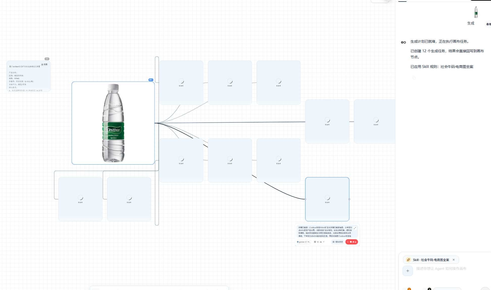
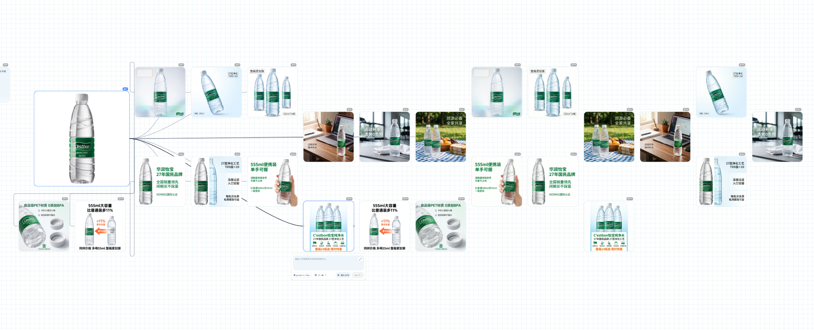
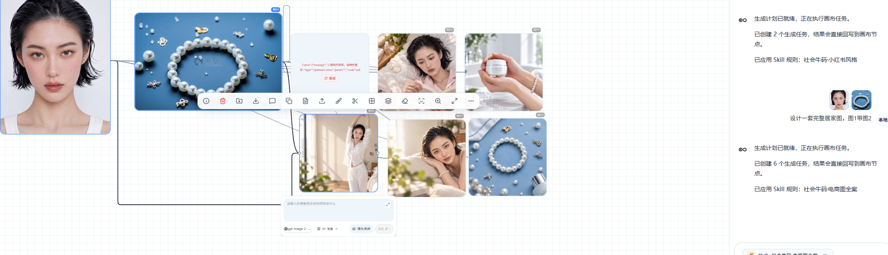
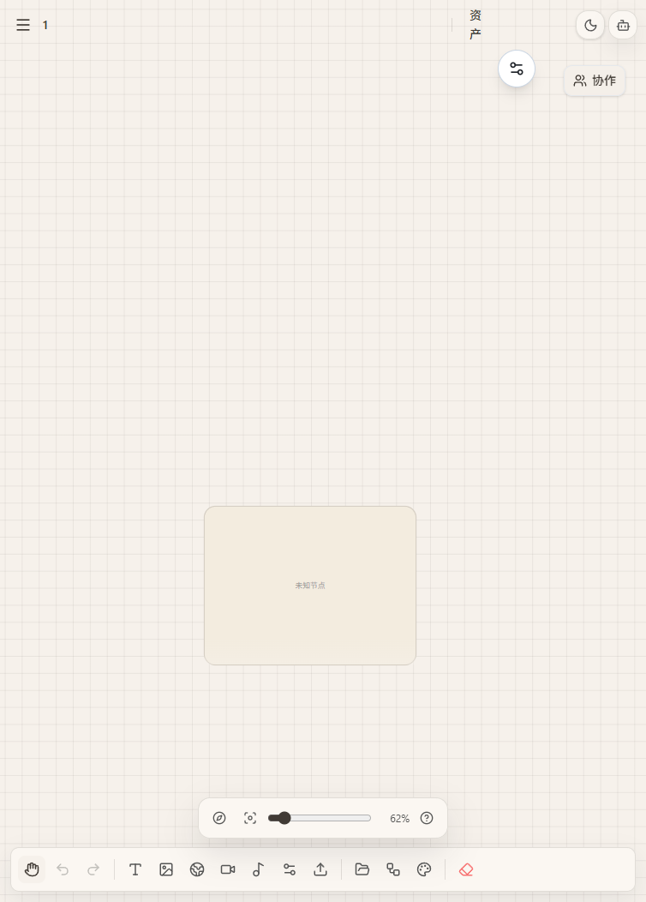
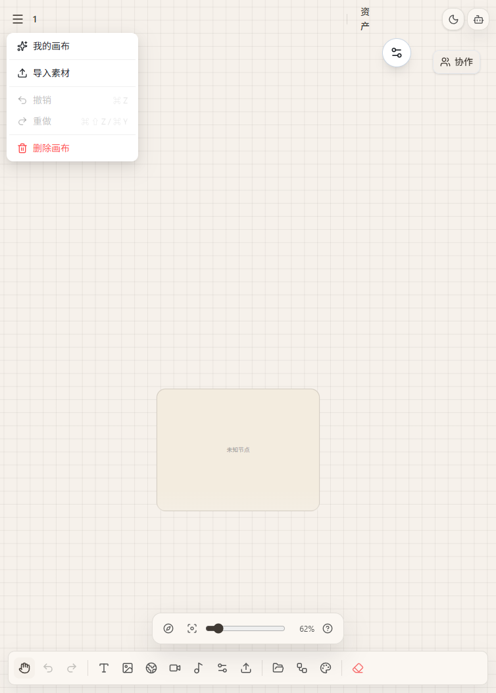
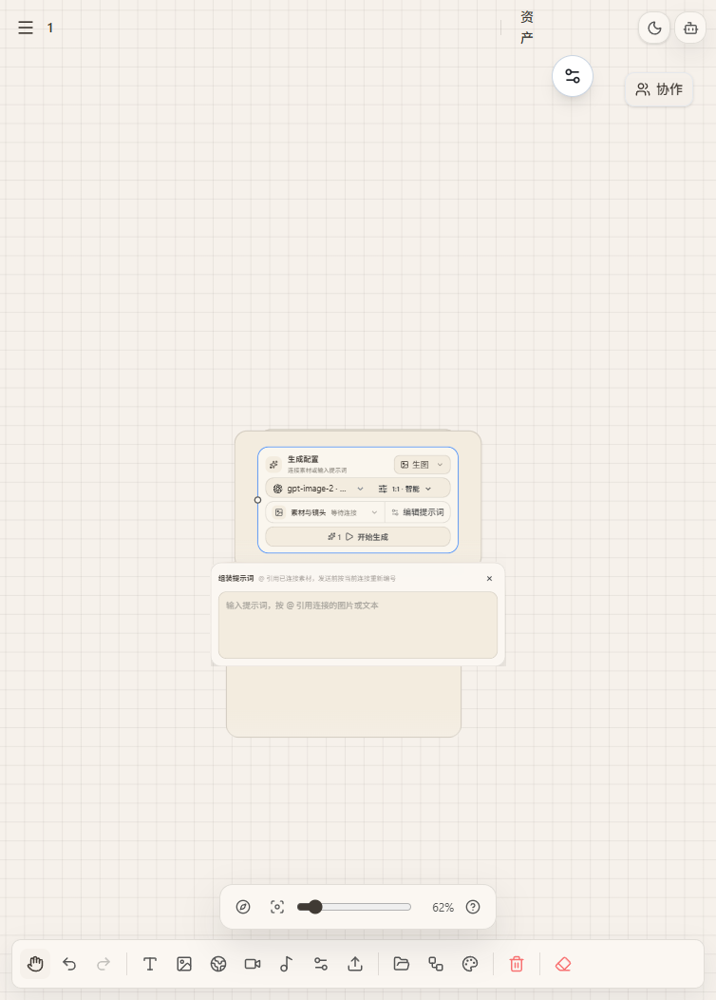
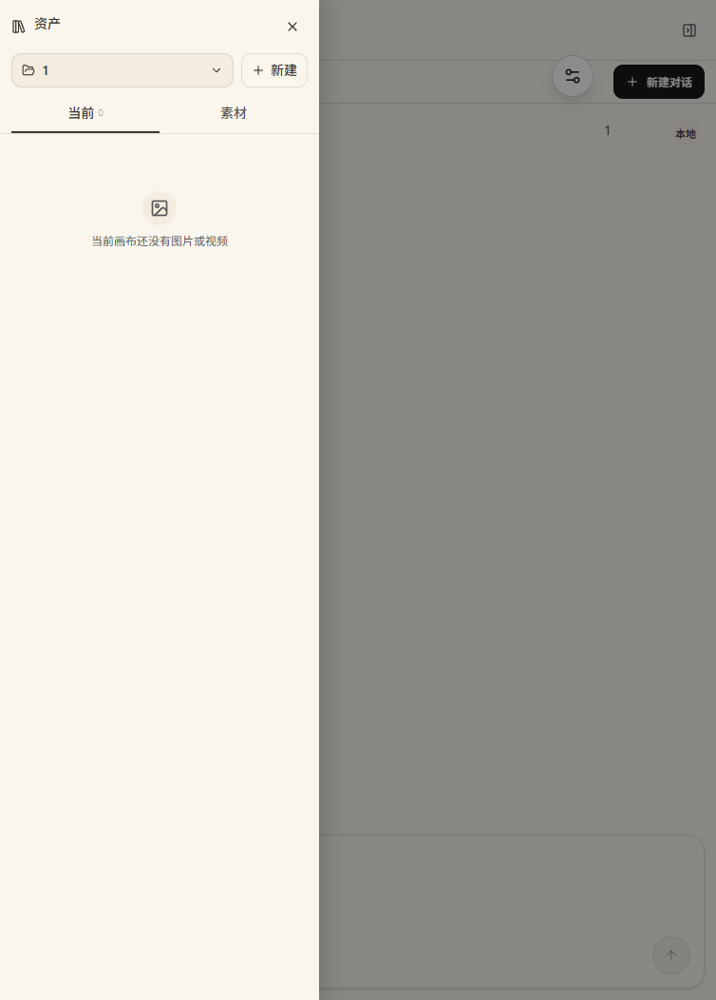
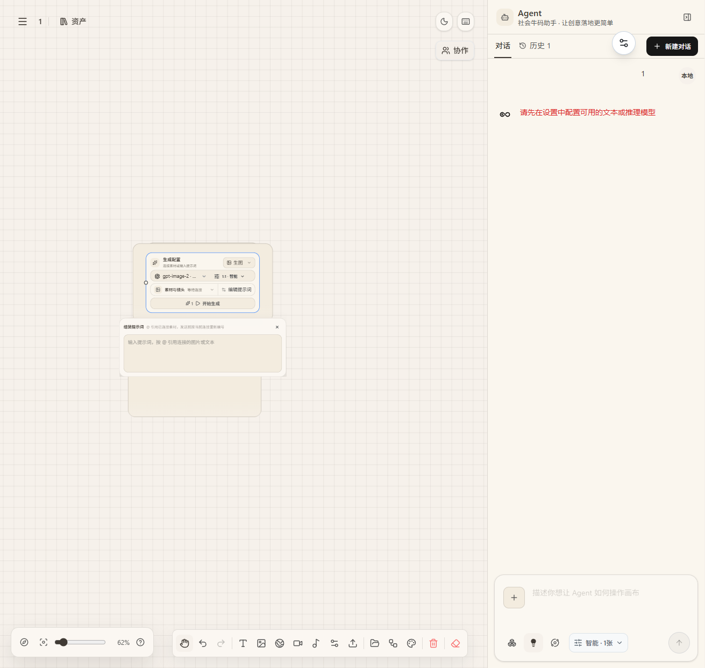

# 普通画布 · Putong Canvas

> 独立的画布与画布 Agent 创作工作台 —— 输入构思意图，Agent 自动规划任务、执行生成、回写画布，完成从创意到成片的创作闭环。

**GNU Affero General Public License v3.0** · 由 sansui-aigc 维护

---

## 📖 目录

- [Agent 自动创作](#-agent-自动创作核心)
- [任务执行与 Skill 规则](#-任务执行与-skill-规则)
- [画布编辑器](#-画布编辑器)
- [节点系统](#-节点系统)
- [资产面板](#-资产面板)
- [工作台全貌](#-工作台全貌)
- [技术栈](#-技术栈)
- [快速开始](#-快速开始)
- [脚本命令](#-脚本命令)
- [常见问题](#-常见问题)
- [许可协议](#-许可协议)
- [更新日志](#-更新日志)

---

## 🤖 Agent 自动创作（核心）

普通画布的核心不是手动操作，而是**指挥 Agent 自动完成创作**：在画布输入构思意图（如「怡宝矿泉水电商视觉全案」），Agent 会自行分析、规划生成任务、按 Skill 规则执行，并把结果直接回写到画布节点。

**电商视觉全案示例**——输入产品意图后，Agent 创建 12 个生成任务并并行执行：



**界面要素：**
- **左侧产品信息卡片**：Agent 自动完成的产品分析（品类 / 价格带 / 目标平台 / 核心卖点）
- **画布节点流**：中心产品图 + 连线排布的多个"生成中"任务节点，实时展示执行进度
- **右侧执行日志**：`生成计划已就绪，正在执行画布任务` → `已创建 12 个生成任务，结果会直接回写到画布节点`
- **Skill 规则**：`已应用 Skill 规则：社会牛码-电商图全案`
- **结果回写**：生成完成后节点自动填充成品图（详情页首屏、多图系列等）

**产品分析思维导图**——Agent 自动把产品信息整理为多分支思维导图节点：



Agent 自动将产品卖点拆解为品牌信任、工艺净化、容量优势、便携性、场景适配等维度，并生成对应的视觉方案节点。

---

## ⚡ 任务执行与 Skill 规则

输入一句话（如「设计一套完整居家图」），Agent 自动创建批量生成任务并按不同 Skill 风格执行：



**界面要素：**
- **参考图 + 生成卡片**：左侧参考图（如女性人像），右侧多张生成结果卡片（珍珠饰品特写、居家场景、手持护肤品等），支持删除 / 下载 / 分享
- **执行日志双任务流**：同时运行「小红书风格」与「电商图全案」两套 Skill 规则
- **生成参数**：`@gpt-image-2 · 智能 · 1张 · 镜头关闭`
- **局部重绘**：选中生成图后，可直接输入「请输入你想要把这张图修改成什么」进行二次创作

**内置 Skill：电商详情页全案**

按「痛点→卖点→证据」逻辑执行两步工作流：
1. **策划阶段**：竞品拆解 → 卖点提炼 → 输出 10-12 屏分屏规划表（每屏主标题/副标题/画面需求）
2. **生图阶段**：确认表格后逐屏生成统一视觉分屏，最后用「拼接长图」一键竖排拼成淘宝整页

支持主图（1图1卖点，含促销版）、详情页（8-12屏）、SKU图（统一模板）。

---

## 🖥️ 画布编辑器

无限画布支持自由拖拽、缩放、节点连线与右键菜单操作，底部工具栏覆盖全部创作动作。



**底部工具栏一览：**

| 图标 | 功能 | 说明 |
| --- | --- | --- |
| 👆 | 框选模式 | 拖拽框选多个节点 |
| ↩️ / ↪️ | 撤销 / 重做 | 操作历史回退 |
| T | 文本 | 创建文本节点 |
| 🖼️ | 图片 | 创建图片节点 |
| 🌐 | 全景图 | 创建 2:1 全景节点 |
| 🎬 | 视频 | 创建视频节点 |
| 🎵 | 音频 | 创建音频节点 |
| ⚙️ | 生成配置 | 创建模型配置节点 |
| 🗂️ | 资产 | 打开资产面板 |
| 🧹 | 一键整理 | 自动排列画布节点 |
| 🎨 | 画布外观 | 主题 / 背景设置 |
| 🗑️ | 清空画布 | 移除全部节点 |
| 🗺️ | 小地图 | 全局视图导航 |
| ⌨️ | 快捷键 | 查看操作快捷键 |

**选中多张图片时**，底部工具栏出现：

| 按钮 | 功能 | 说明 |
| --- | --- | --- |
| 📚 拼接 | 拼接长图 | 将选中的图片竖排拼成淘宝详情页长图，或横排并排 |
| ⬇️ 下载 N | 批量下载 | 一键下载所有选中的图片/视频 |

**画布菜单**（左上角）：



菜单提供：我的画布、撤销 / 重做、删除画布等操作。

---

## 🧩 节点系统

通过底部工具栏创建不同类型的节点，节点之间用连线建立数据流，形成创作管线。

### 生成配置节点（核心编排）



**生成配置**是创作管线的大脑：
- **模型选择**：`gpt-image-2-…` 等可用模型
- **素材与镜头**：挂接上游素材 / 设置镜头参数
- **编辑提示词**：`输入提示词，按 @ 引用挂接的图片或文本`
- **开始生成**：一键执行生成并回填画布

### 节点类型一览

| 节点 | 用途 | 关键能力 |
| --- | --- | --- |
| 🖼️ 图片 | 生成 / 引用图片 | 多图系列、人脸检测、主体分割、裁切 / 蒙版 / 放大 / 拆分 |
| 🌐 全景图 | 2:1 全景生成 / 导入 | 全景预览（Photo Sphere Viewer） |
| 📝 文本 | 提示词 / 文案素材 | 富文本编辑（TipTap） |
| ⚙️ 生成配置 | 模型 / 尺寸 / 数量编排 | 素材挂接、镜头控制、@ 引用 |
| 🎬 视频 | 视频生成 / 参考引用 | 摄像机控制（镜头 / 焦距 / 光圈自动写入提示词） |
| 🎵 音频 | 音频生成 / 配音 | 音频设置面板 |

---

## 🗂️ 资产面板

画布内所有图片 / 视频素材的集中管理入口，支持 `当前`（本画布）与 `素材`（全库）两种视图。



- **当前**：本画布已生成的图片 / 视频
- **素材**：服务器素材库 + 我的素材，全链路复用

---

## 🖥️ 工作台全貌

生成配置面板与 Agent 面板同屏协作：左侧编排生成参数，右侧指挥 Agent 执行创作。



---

## 🛠️ 技术栈

| 领域 | 技术 |
| --- | --- |
| 框架 | React 19 · Next.js 16 · Vite 8 |
| 语言 | TypeScript 5 |
| 状态管理 | Zustand 5 · TanStack Query 5 |
| UI 组件 | Ant Design 6 · Tailwind CSS 4 |
| 富文本 | TipTap 3 · React Markdown |
| 图像能力 | MediaPipe Tasks Vision（人脸检测 / 主体分割） |
| 全景预览 | Photo Sphere Viewer |
| 存储 | AWS S3 SDK（可选对象存储）· 本地文件存储 |
| 测试 | Vitest · Playwright（E2E） |

---

## 🏗️ 快速开始

### 环境要求

- Node.js 20+
- pnpm 9+

### 安装与运行

```powershell
# 1. 克隆仓库
git clone https://github.com/sansui-aigc/putong-huabu.git
cd putong-huabu

# 2. 安装依赖
pnpm install --frozen-lockfile

# 3. 配置环境变量（复制模板为 .env.local 并填写）
Copy-Item .env.example .env.local
# 编辑 .env.local：填入模型渠道 API Key（VOZEB_PRO_PROVIDER_API_KEY=sk-...）

# 4. 配置模型渠道（复制示例并按需编辑）
Copy-Item config\models.example.json config\models.json

# 5. 启动开发服务器
pnpm run dev
```

启动后访问 **http://localhost:3002/canvas**。

> `pnpm run dev` 会同时启动独立 API 与生成 Worker。模型渠道从 `config/models.json` 读取，密钥只放在 `.env.local` 环境变量中，不会发送到浏览器。

### 首次使用（网页初始化）

打开 **http://localhost:3002/install** 进入安装向导：
- **本地文件存储模式**（默认）：无需 PostgreSQL，模型与密钥由服务器配置管理，确认后即可开始创作
- **数据库模式**：填写 PostgreSQL 连接信息，完成初始化后创建管理员账号

---

## 📁 项目结构

```
├── config/                 # 模型渠道等配置模板
├── e2e/                    # Playwright 端到端测试
├── public/                 # 静态资源（worker、模型、图标）
├── scripts/                # 构建 / 运行 / 运维脚本
├── src/
│   ├── app/
│   │   ├── (user)/canvas/  # 画布创作工作台（核心）
│   │   └── api/            # 服务端 API 路由
│   ├── components/         # 通用 UI 组件
│   ├── lib/                # 服务端逻辑 / 协议 / 工具库
│   ├── providers/          # 模型渠道 Provider（OpenAI / Gemini 等）
│   └── services/           # 文件存储等外部服务封装
├── .env.example            # 环境变量模板
└── package.json
```

---

## 🔧 脚本命令

| 命令 | 说明 |
| --- | --- |
| `pnpm dev` | 启动开发服务器（API + Worker + 前端，端口 3002） |
| `pnpm build` | 构建生产产物（Vite） |
| `pnpm start` | 启动独立生产服务器 |
| `pnpm test` | 运行单元测试（Vitest） |
| `pnpm e2e` | 运行端到端测试（Playwright） |
| `pnpm typecheck` | TypeScript 类型检查 |
| `pnpm lint` | ESLint 代码检查 |

---

## ❓ 常见问题

**Q：如何配置 AI 模型渠道？**
A：复制 `config\models.example.json` 为 `config\models.json` 并填写渠道 baseUrl 与模型 ID；API Key 写在 `.env.local`（`VOZEB_PRO_PROVIDER_API_KEY=sk-...`），模型密钥只放服务器环境变量，不会发送到浏览器。

**Q：Agent 提示未配置模型怎么办？**
A：确认已完成上面的模型渠道与 `.env.local` 配置后重启 `pnpm run dev`；也可通过网页向导 `http://localhost:3002/install` 检查初始化状态。

**Q：是否需要数据库？**
A：不需要。默认使用本地文件存储；如需对象存储，可配置 AWS S3。

**Q：如何参与协作？**
A：打开画布右上角「协作」按钮，邀请成员实时共同编辑。

---

## 🕐 更新日志

### v0.0.9 (2026-09-20)

**新增**
- 电商详情页全案 Skill：按「痛点→卖点→证据」两步工作流，先出 10-12 屏分屏规划表，确认后逐屏生图
- 图片拼接长图：选中多张图片一键竖排拼成淘宝详情页整页，或横排并排
- 视频 API 通用兼容：自动识别 seedance/wan/omni 等模型，统一走 `/v1/videos` 标准格式

**改进**
- 未配置模型可直接进入画布使用本地功能（上传/拼接/整理）

完整更新记录见 [CHANGELOG.md](./CHANGELOG.md)。

---

## 📄 许可协议

本项目采用 **GNU Affero General Public License v3.0（AGPL-3.0）**。

这是最严格的开源协议之一：任何以本项目为基础提供网络服务（SaaS）的衍生作品，都必须以 AGPL-3.0 协议完整开放其源代码。详见 [LICENSE](./LICENSE)。

---

**© 2026 sansui-aigc** · 社会牛码创作工作台

---

## 📋 更新日志

各版本变更详见 [CHANGELOG.md](./CHANGELOG.md)。
