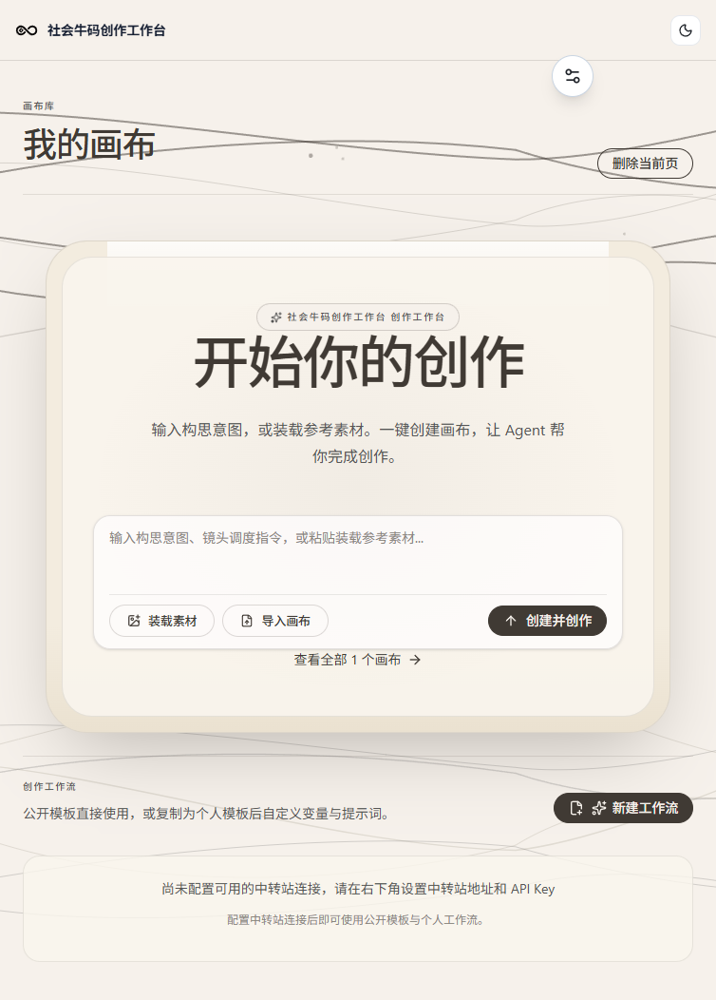

# 普通画布 · Putong Canvas

> 独立的画布与画布 Agent 创作工作台 —— 用无限画布组织多模态素材，让 Agent 完成从构思到成片的创作闭环。



---

## 📖 目录

- [项目简介](#-项目简介)
- [核心功能](#-核心功能)
- [界面预览](#-界面预览)
- [技术栈](#-技术栈)
- [快速开始](#-快速开始)
- [项目结构](#-项目结构)
- [脚本命令](#-脚本命令)
- [常见问题](#-常见问题)
- [许可协议](#-许可协议)

---

## ✨ 项目简介

**普通画布（Putong Canvas）** 是一个以无限画布为核心的多模态 AI 创作工作台。你将图片、全景图、文本、视频、音频等素材以节点形式铺在画布上，通过连线建立数据流，再交给 Agent 按"上游节点 → 引用 → 生成 → 回填画布"的方式自动完成创作任务。

- **应用入口**：`/canvas`
- **默认端口**：`3002`（避免与常规项目 3000 端口冲突）
- **数据存储**：默认本地文件存储，无需 SQL 数据库，也无需安装令牌

---

## 🚀 核心功能

### 1. 无限画布节点系统

| 节点类型 | 用途 |
| --- | --- |
| 🖼️ 图片 | 生成图片 / 上传素材 / 多图系列 |
| 🌐 全景图 | 2:1 全景生成 / 导入，可作 3D 场景环境 |
| 📝 文本 | 提示词 / 文案 / 创作素材 |
| ⚙️ 生成配置 | 模型、尺寸、数量与输入顺序编排 |
| 🎬 视频 | 视频生成 / 参考视频引用 |
| 🎵 音频 | 音频生成 / 配音素材 |

### 2. Agent 深度创作

- **自动引用**：选中节点后，其上游节点自动纳入 Agent 引用上下文，无需手动拼提示词
- **Chat / Responses 双协议**：灵活适配不同模型渠道
- **严格工具校验**：JSON 修复、单次超 12 个操作整批拒绝，避免失控生成
- **协作模式**：支持多人实时协作编辑同一画布

### 3. 创作工作流

- 公开模板 / 个人模板，一键复制使用
- 变量表单驱动，批量生成单图 / 多图系列
- 素材库全链路复用

### 4. 专业图像工具

- 人脸检测、主体分割（MediaPipe 本地推理）
- 裁切、角度、情绪、蒙版、放大、拆分等节点级编辑
- 摄像机控制：图片 / 视频节点可设相机 / 镜头 / 焦距 / 光圈，自动写入提示词

---

## 🖥️ 界面预览

### 首页 · 创作入口


首页以「中央创作岛」为视觉核心，输入构思意图或装载参考素材，一键创建画布开始创作。

### 画布编辑器


无限画布支持自由拖拽、缩放（百分比指示）、节点连接与右键菜单操作。

### 画布操作菜单


左上角菜单提供导入素材、撤销 / 重做、删除画布等操作。

---

## 🛠️ 技术栈

| 领域 | 技术 |
| --- | --- |
| 框架 | React 19 · Next.js 16 · Vite 8 |
| 语言 | TypeScript 5 |
| 状态管理 | Zustand 5 · TanStack Query 5 |
| UI 组件 | Ant Design 6 · Tailwind CSS 4 |
| 富文本 | TipTap 3 · React Markdown |
| 图像能力 | MediaPipe Tasks Vision（人脸检测 / 主体分割） |
| 全景预览 | Photo Sphere Viewer |
| 存储 | AWS S3 SDK（可选对象存储）· 本地文件存储 |
| 测试 | Vitest · Playwright（E2E） |

---

## 🏗️ 快速开始

### 环境要求

- Node.js 20+
- pnpm 9+

### 安装与运行

```powershell
# 1. 克隆仓库
git clone https://github.com/sansui-aigc/putong-huabu.git
cd putong-huabu

# 2. 安装依赖
pnpm install --frozen-lockfile

# 3. 配置环境变量（可选，使用 .env.example 模板）
Copy-Item ..\.env.example .env.local

# 4. 启动开发服务器
pnpm run dev
```

启动后访问 **http://localhost:3002/canvas**。

> `pnpm run dev` 会同时启动独立 API 与生成 Worker；模型渠道配置见 `config/models.example.json`。

---

## 📁 项目结构

```
├── config/                 # 模型渠道等配置模板
├── e2e/                    # Playwright 端到端测试
├── public/                 # 静态资源（worker、模型、图标）
├── scripts/                # 构建 / 运行 / 运维脚本
├── src/
│   ├── app/
│   │   ├── (user)/canvas/  # 画布创作工作台（核心）
│   │   └── api/            # 服务端 API 路由
│   ├── components/         # 通用 UI 组件
│   ├── lib/                # 服务端逻辑 / 协议 / 工具库
│   ├── providers/          # 模型渠道 Provider（OpenAI / Gemini 等）
│   └── services/           # 文件存储等外部服务封装
├── .env.example            # 环境变量模板
└── package.json
```

---

## 🔧 脚本命令

| 命令 | 说明 |
| --- | --- |
| `pnpm dev` | 启动开发服务器（API + Worker + 前端，端口 3002） |
| `pnpm build` | 构建生产产物（Vite） |
| `pnpm start` | 启动独立生产服务器 |
| `pnpm test` | 运行单元测试（Vitest） |
| `pnpm e2e` | 运行端到端测试（Playwright） |
| `pnpm typecheck` | TypeScript 类型检查 |
| `pnpm lint` | ESLint 代码检查 |

---

## ❓ 常见问题

**Q：如何配置 AI 模型渠道？**
A：复制 `config/models.example.json` 为实际配置，并在 `.env.local` 中填写中转站地址与 API Key；画布右下角「设置」中也可配置。

**Q：是否需要数据库？**
A：不需要。默认使用本地文件存储；如需对象存储，可配置 AWS S3。

**Q：如何参与协作？**
A：打开画布右上角「协作」按钮，邀请成员实时共同编辑。

---

## 📄 许可协议

本项目采用 **GNU Affero General Public License v3.0（AGPL-3.0）**。

这是最严格的开源协议之一：任何以本项目为基础提供网络服务（SaaS）的衍生作品，都必须以 AGPL-3.0 协议完整开放其源代码。详见 [LICENSE](./LICENSE)。

---

**© 2026 sansui-aigc** · 社会牛码创作工作台
