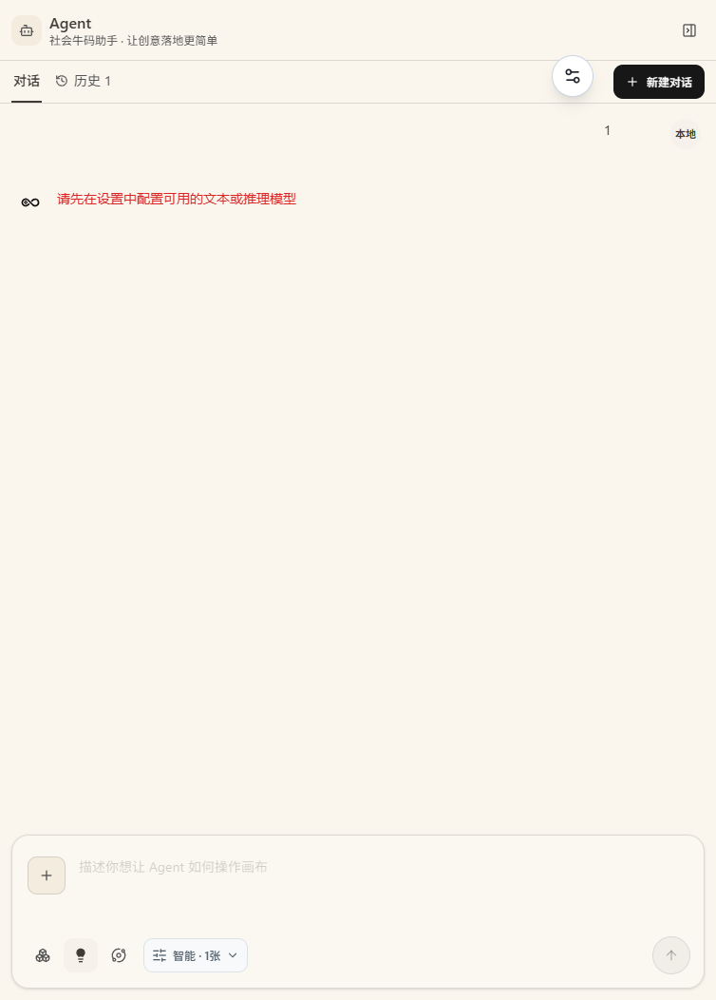
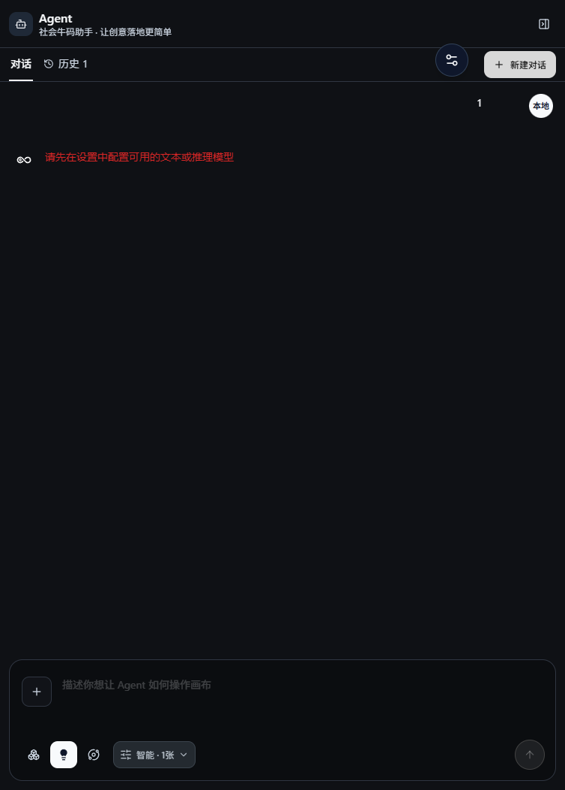

# 普通画布 · Putong Canvas

> 独立的画布与画布 Agent 创作工作台 —— 用无限画布组织多模态素材，让 Agent 完成从构思到成片的创作闭环。

**GNU Affero General Public License v3.0** · 由 sansui-aigc 维护

---

## 📖 目录

- [Agent 界面](#-agent-界面核心)
- [画布编辑器](#-画布编辑器)
- [节点系统](#-节点系统每个功能的界面)
- [资产面板](#-资产面板)
- [工作台全貌](#-工作台全貌)
- [技术栈](#-技术栈)
- [快速开始](#-快速开始)
- [脚本命令](#-脚本命令)
- [常见问题](#-常见问题)
- [许可协议](#-许可协议)

---

## 🤖 Agent 界面（核心）

Agent 是普通画布的创作引擎：你选中画布节点后，**上游节点会自动纳入 Agent 的引用上下文**，无需手动拼接提示词。Agent 支持 Chat / Responses 双协议、严格工具校验（JSON 修复、单次超 12 个操作整批拒绝），并在画布上直接回填生成结果。

### 浅色主题



**界面要素：**
- **对话 / 历史**：左侧导航切换当前对话与历史会话
- **新建对话**：一键开启新的创作会话
- **本地**：标注当前运行模式
- **输入区**：`描述你想让 Agent 如何操作画布`，支持 @ 引用画布中的图片 / 文本节点
- **生成参数**：`智能 · 1张` 选择生成数量与模式

### 深色主题



> 未配置模型渠道时，Agent 面板会提示「请先在设置中配置可用的文本或推理模型」——在画布右下角设置中转站地址与 API Key 即可。

---

## 🖥️ 画布编辑器

无限画布支持自由拖拽、缩放、节点连线与右键菜单操作，底部工具栏覆盖全部创作动作。


**底部工具栏一览：**

| 图标 | 功能 | 说明 |
| --- | --- | --- |
| 👆 | 框选模式 | 拖拽框选多个节点 |
| ↩️ / ↪️ | 撤销 / 重做 | 操作历史回退 |
| T | 文本 | 创建文本节点 |
| 🖼️ | 图片 | 创建图片节点 |
| 🌐 | 全景图 | 创建 2:1 全景节点 |
| 🎬 | 视频 | 创建视频节点 |
| 🎵 | 音频 | 创建音频节点 |
| ⚙️ | 生成配置 | 创建模型配置节点 |
| 📤 | 上传素材 | 从本地装载文件 |
| 🗂️ | 资产 | 打开资产面板 |
| 🧹 | 一键整理 | 自动排列画布节点 |
| 🎨 | 画布外观 | 主题 / 背景设置 |
| 🗑️ | 清空画布 | 移除全部节点 |
| 🗺️ | 小地图 | 全局视图导航 |
| ⌨️ | 快捷键 | 查看操作快捷键 |

**画布菜单**（左上角）：


菜单提供：我的画布、导入素材、撤销 / 重做、删除画布等操作。

---

## 🧩 节点系统（每个功能的界面）

通过底部工具栏创建不同类型的节点，节点之间用连线建立数据流，形成创作管线。

### 生成配置节点（核心编排）


**生成配置**是创作管线的大脑：
- **模型选择**：`gpt-image-2-…` 等可用模型
- **素材与镜头**：等待挂接上游素材 / 设置镜头参数
- **编辑提示词**：`输入提示词，按 @ 引用挂接的图片或文本`
- **开始生成**：一键执行生成并回填画布

### 节点类型一览

| 节点 | 用途 | 关键能力 |
| --- | --- | --- |
| 🖼️ 图片 | 生成 / 上传图片 | 多图系列、人脸检测、主体分割、裁切 / 蒙版 / 放大 / 拆分 |
| 🌐 全景图 | 2:1 全景生成 / 导入 | 全景预览（Photo Sphere Viewer） |
| 📝 文本 | 提示词 / 文案素材 | 富文本编辑（TipTap） |
| ⚙️ 生成配置 | 模型 / 尺寸 / 数量编排 | 素材挂接、镜头控制、@ 引用 |
| 🎬 视频 | 视频生成 / 参考引用 | 摄像机控制（镜头 / 焦距 / 光圈自动写入提示词） |
| 🎵 音频 | 音频生成 / 配音 | 音频设置面板 |

---

## 🗂️ 资产面板

画布内所有图片 / 视频素材的集中管理入口，支持 `当前`（本画布）与 `素材`（全库）两种视图。


- **当前**：本画布已生成的图片 / 视频
- **素材**：服务器素材库 + 我的素材，全链路复用
- **+ 新建**：创建新的素材集合

---

## 🖥️ 工作台全貌

生成配置面板与 Agent 面板同屏协作：左侧编排生成参数，右侧指挥 Agent 执行创作。


---

## 🛠️ 技术栈

| 领域 | 技术 |
| --- | --- |
| 框架 | React 19 · Next.js 16 · Vite 8 |
| 语言 | TypeScript 5 |
| 状态管理 | Zustand 5 · TanStack Query 5 |
| UI 组件 | Ant Design 6 · Tailwind CSS 4 |
| 富文本 | TipTap 3 · React Markdown |
| 图像能力 | MediaPipe Tasks Vision（人脸检测 / 主体分割） |
| 全景预览 | Photo Sphere Viewer |
| 存储 | AWS S3 SDK（可选对象存储）· 本地文件存储 |
| 测试 | Vitest · Playwright（E2E） |

---

## 🏗️ 快速开始

### 环境要求

- Node.js 20+
- pnpm 9+

### 安装与运行

```powershell
# 1. 克隆仓库
git clone https://github.com/sansui-aigc/putong-huabu.git
cd putong-huabu

# 2. 安装依赖
pnpm install --frozen-lockfile

# 3. 配置环境变量（可选，使用 .env.example 模板）
Copy-Item ..\.env.example .env.local

# 4. 启动开发服务器
pnpm run dev
```

启动后访问 **http://localhost:3002/canvas**。

> `pnpm run dev` 会同时启动独立 API 与生成 Worker；模型渠道配置见 `config/models.example.json`。

---

## 📁 项目结构

```
├── config/                 # 模型渠道等配置模板
├── e2e/                    # Playwright 端到端测试
├── public/                 # 静态资源（worker、模型、图标）
├── scripts/                # 构建 / 运行 / 运维脚本
├── src/
│   ├── app/
│   │   ├── (user)/canvas/  # 画布创作工作台（核心）
│   │   └── api/            # 服务端 API 路由
│   ├── components/         # 通用 UI 组件
│   ├── lib/                # 服务端逻辑 / 协议 / 工具库
│   ├── providers/          # 模型渠道 Provider（OpenAI / Gemini 等）
│   └── services/           # 文件存储等外部服务封装
├── .env.example            # 环境变量模板
└── package.json
```

---

## 🔧 脚本命令

| 命令 | 说明 |
| --- | --- |
| `pnpm dev` | 启动开发服务器（API + Worker + 前端，端口 3002） |
| `pnpm build` | 构建生产产物（Vite） |
| `pnpm start` | 启动独立生产服务器 |
| `pnpm test` | 运行单元测试（Vitest） |
| `pnpm e2e` | 运行端到端测试（Playwright） |
| `pnpm typecheck` | TypeScript 类型检查 |
| `pnpm lint` | ESLint 代码检查 |

---

## ❓ 常见问题

**Q：如何配置 AI 模型渠道？**
A：复制 `config/models.example.json` 为实际配置，并在 `.env.local` 中填写中转站地址与 API Key；画布右下角「设置」中也可配置。

**Q：Agent 提示未配置模型怎么办？**
A：打开 Agent 面板右上角设置图标，配置可用的文本 / 推理模型渠道。

**Q：是否需要数据库？**
A：不需要。默认使用本地文件存储；如需对象存储，可配置 AWS S3。

**Q：如何参与协作？**
A：打开画布右上角「协作」按钮，邀请成员实时共同编辑。

---

## 📄 许可协议

本项目采用 **GNU Affero General Public License v3.0（AGPL-3.0）**。

这是最严格的开源协议之一：任何以本项目为基础提供网络服务（SaaS）的衍生作品，都必须以 AGPL-3.0 协议完整开放其源代码。详见 [LICENSE](./LICENSE)。

---

**© 2026 sansui-aigc** · 社会牛码创作工作台
